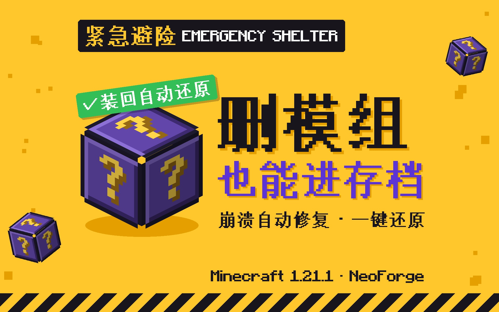
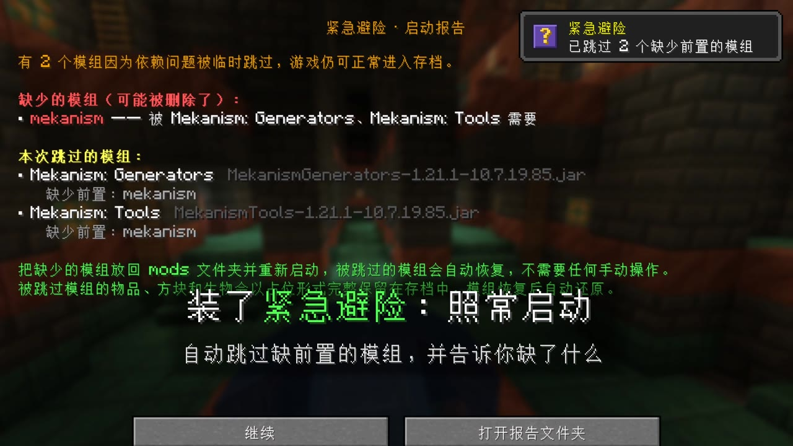
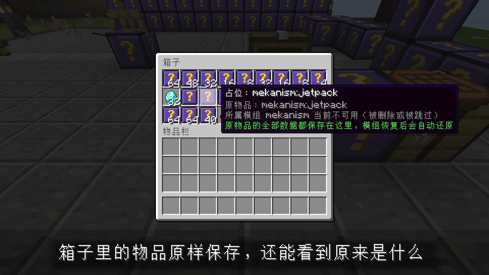
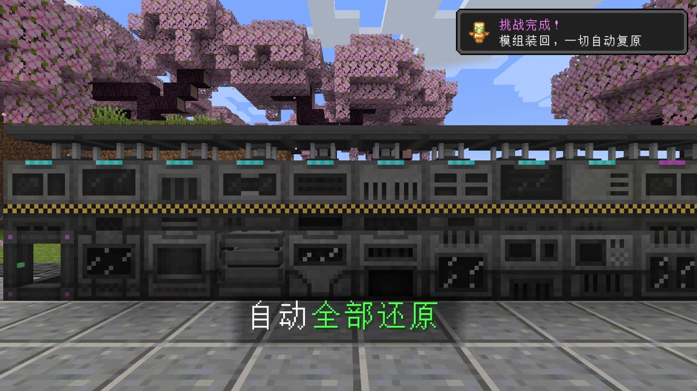
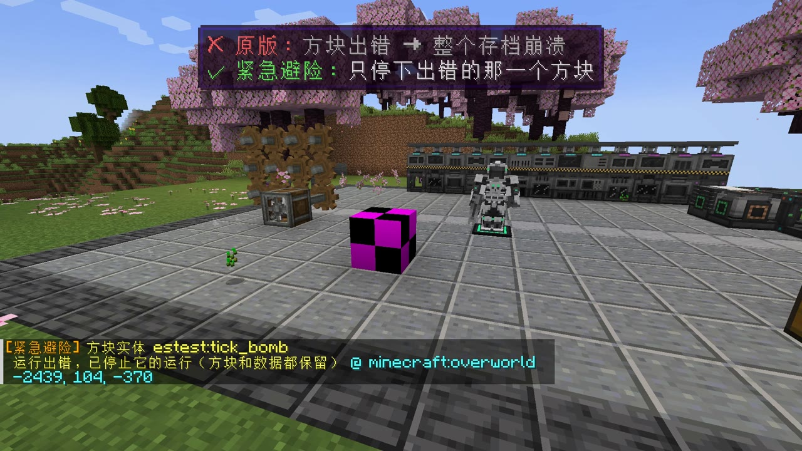

<p align="center"></p>

<p align="center">
  <b>中文</b> | <a href="#english">English</a>
</p>

# 紧急避险 Emergency Shelter

Minecraft 1.21.1 · NeoForge 的整合包安全网。

删了模组、模组出错、存档或配置坏了，游戏一般会直接崩，存档也进不去。装了紧急避险，它会尽量把问题挡住，让你照常进存档，东西也不会丢；模组装回来以后自动还原。

## 功能

- **缺前置也能启动**：缺前置、版本不对、重复或损坏的模组会被临时跳过，游戏照常打开，主菜单弹出报告说明缺了什么。补回来后自动恢复。
- **删了模组，东西还在**：所属模组不在了的物品、方块、生物会以占位形式保存，数据一点不少；模组附加在玩家身上的数据也会保留。模组装回后自动变回原样。
- **避险箱**：背包和末影箱里的占位物品自动收进每个玩家自己的避险箱（`/避险箱`）。
- **运行出错不再崩**：出错的机器会被停下，出错的生物变成占位，出错的物品移进避险箱，区块里有问题的模组数据先暂存。模组更新或增删后会自动重试。
- **加载崩溃自动修复**：下次启动时先换回最近改过的配置，还不行才跳过对应模组。
- **存档和配置保护**：每次正常退出都会备份重要文件，文件读不出来时换回上次正常的版本；少了模组时进存档前自动备份。配置文件写坏或被删时自动恢复。
- **画面、光影、材质包**：渲染出错只隐藏出错的那一部分；光影或材质包弄崩游戏时，下次启动自动关掉它们。
- **地形生成、数据包、KubeJS / CraftTweaker 脚本、卡死、数据过大、实体过多**：只隔离出错的那一部分，不让整个存档进不去。
- **安全模式**：暂停整个世界（机器、生物、刷怪都不动），方便处理出问题的东西。

| 缺前置时照常启动 | 机器变成占位方块 |
| :---: | :---: |
|  |  |
| **物品原样保存** | **模组装回后自动还原** |
|  |  |



## 安装

1. 需要 Minecraft 1.21.1 和 NeoForge 21.1 或更新版本。
2. 把 jar 放进 `mods` 文件夹，服务器也放一份。
3. 装好后正常进出一次存档，让它记下"正常的样子"。

要在删别的模组之前装好它，装了以后也不要删它，它保管的数据都在它身上。

## 命令

| 命令 | 说明 |
| --- | --- |
| `/避险箱` | 打开避险箱 |
| `/emergencyshelter return` | 维度回来后回到原来的位置 |
| `/emergencyshelter report` | 查看这次挡下了哪些问题（管理员） |
| `/emergencyshelter quarantine [retry\|entities]` | 查看或重试被停下、隔离的东西（管理员） |
| `/emergencyshelter config restore <模组id>` | 把某个模组的配置换回上次正常的（管理员） |
| `/emergencyshelter safemode on\|off` | 开关安全模式（管理员） |

设置文件在游戏目录的 `emergencyshelter/settings.json`，每个功能都能单独关掉。

## 从源码构建

需要 JDK 21。

```sh
./gradlew build
```

Windows 下用 `gradlew.bat build`。成品在 `build/libs/emergencyshelter-<版本>.jar`；带 `-mod` 后缀的那个是内嵌在成品里的游戏内部分，不能单独使用。

源码分两部分：

- `src/early`：在 NeoForge 扫描 mods 文件夹之前运行的服务，负责跳过坏模组、配置保护、启动分析，不能引用任何游戏类。
- `src/main`：游戏内模组，负责占位、避险箱、存档保护和各种出错拦截（Mixin）。

## 许可证

[MIT](LICENSE)

---

<a id="english"></a>

<p align="center">
  <a href="#紧急避险-emergency-shelter">中文</a> | <b>English</b>
</p>

# Emergency Shelter

A safety net for modpacks on Minecraft 1.21.1 · NeoForge.

Removing a mod, a mod throwing errors, or a broken save or config file usually means a crash and a world you can't open. Emergency Shelter catches as much of that as it can so you can keep playing without losing anything, and puts everything back once the missing mod returns.

## Features

- **Starts even with missing dependencies**: mods with missing or wrong-version dependencies, duplicates and broken jars are skipped for this launch, and a report on the title screen tells you what is missing. Everything comes back once you fix it.
- **Removed mods don't take your stuff with them**: items, blocks and entities from a missing mod are kept as placeholders with all of their data, as are mod attachments on players. They turn back into the originals when the mod is reinstalled.
- **Shelter box**: placeholder items in your inventory and ender chest are moved into a per-player shelter box (`/避险箱`).
- **Runtime errors no longer crash the game**: a block entity that throws is frozen, a broken entity becomes a placeholder, a broken item moves to the shelter box, and bad mod data in a chunk is stashed. They are retried automatically after mods change.
- **Self-healing load crashes**: on the next launch it first rolls back recently changed configs, and only skips the mod if that doesn't help.
- **Save and config protection**: important files are backed up on every clean exit and restored if they become unreadable; the world is backed up before loading with fewer mods. Corrupted or deleted configs are restored.
- **Rendering, shaders and resource packs**: a render error only hides the broken element; shaders or resource packs that crash the game are disabled on the next launch.
- **World generation, datapacks, KubeJS / CraftTweaker scripts, hangs, oversized data, entity overflow**: only the broken part is isolated instead of locking you out of the world.
- **Safe mode**: pauses the whole world (machines, mobs, spawning) so you can deal with whatever is broken.

Screenshots are shown in the Chinese section above.

## Installation

1. Requires Minecraft 1.21.1 and NeoForge 21.1 or newer.
2. Put the jar in your `mods` folder, on the server as well.
3. Enter and leave a world once so it can record a known-good state.

Install it before removing other mods, and don't remove it afterwards: the data it keeps for you lives in it.

## Commands

| Command | Description |
| --- | --- |
| `/避险箱` | Open your shelter box |
| `/emergencyshelter return` | Go back to where you were once a missing dimension returns |
| `/emergencyshelter report` | Show what was caught this session (op) |
| `/emergencyshelter quarantine [retry\|entities]` | List or retry frozen and quarantined things (op) |
| `/emergencyshelter config restore <modid>` | Roll a mod's config back to the last good copy (op) |
| `/emergencyshelter safemode on\|off` | Toggle safe mode (op) |

Settings live in `emergencyshelter/settings.json` in the game directory; every feature can be turned off on its own.

## Building from source

Requires JDK 21.

```sh
./gradlew build
```

Use `gradlew.bat build` on Windows. The output is `build/libs/emergencyshelter-<version>.jar`. The `-mod` jar is the in-game part that gets embedded in it and does not work on its own.

The source has two parts:

- `src/early`: a service that runs before NeoForge scans the mods folder. It skips broken mods, guards configs and profiles startup, and must not reference any game classes.
- `src/main`: the in-game mod: placeholders, the shelter box, save protection and the error guards (Mixins).

## License

[MIT](LICENSE)
